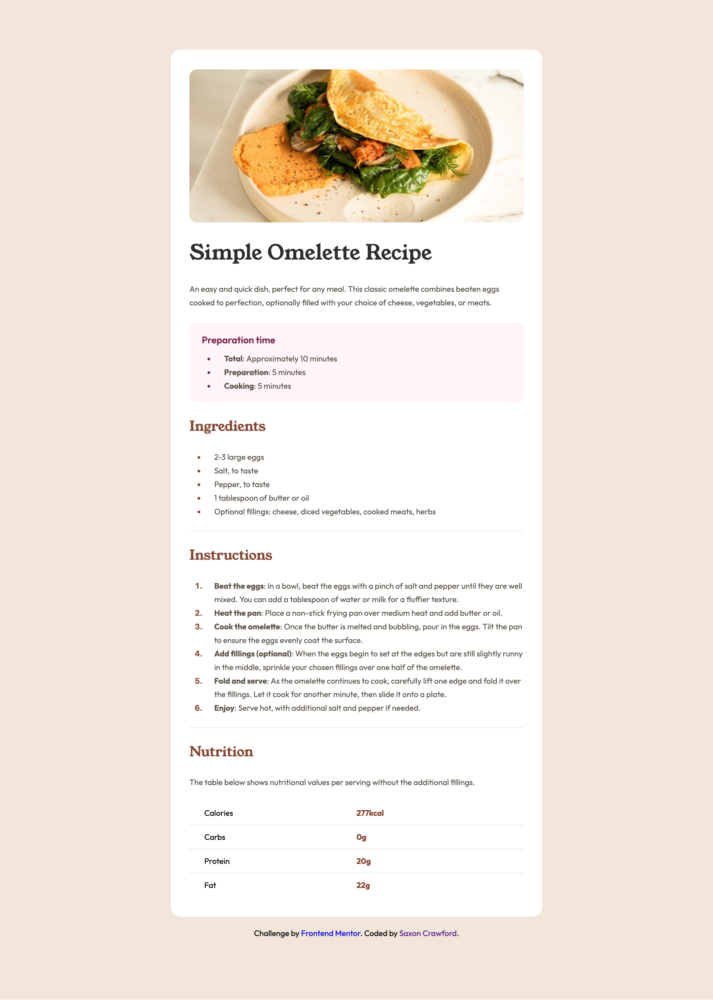

# Frontend Mentor - Recipe page solution

This is a solution to the [Recipe page challenge on Frontend Mentor](https://www.frontendmentor.io/challenges/recipe-page-KiTsR8QQKm). Frontend Mentor challenges help you improve your coding skills by building realistic projects. 

## Table of contents

- [Frontend Mentor - Recipe page solution](#frontend-mentor---recipe-page-solution)
  - [Table of contents](#table-of-contents)
  - [Overview](#overview)
    - [Screenshot](#screenshot)
    - [Links](#links)
  - [My process](#my-process)
    - [Built with](#built-with)
    - [What I learned](#what-i-learned)
    - [Continued development](#continued-development)
  - [Author](#author)

## Overview

### Screenshot

### Links

- Solution URL: [Recipe Page Repo](https://github.com/saxcrawford/recipe-page)

## My process

### Built with

- Semantic HTML5 markup
- CSS custom properties
- Flexbox
- CSS Grid
- Mobile-first workflow

### What I learned

This project was a great opportunity to practice foundational HTML and CSS skills. I focused on creating a clean, semantic structure and writing maintainable, responsive CSS. Here are some of the key things I learned.

### Continued development

I look forward to using this project as I continue learning and expand functionality of the site to inlude more advanced features. Some features that interest me would be adding more recipes, adding a database to store more information, converting the site into more of what a recipe book would function as.

## Author

- Website - [Saxon Crawford](https://saxcrawford.github.io/portfolio-saxon/)
- Frontend Mentor - [@saxcrawford](https://www.frontendmentor.io/profile/saxcrawford)